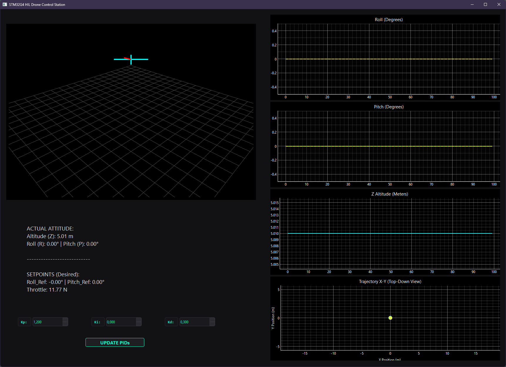
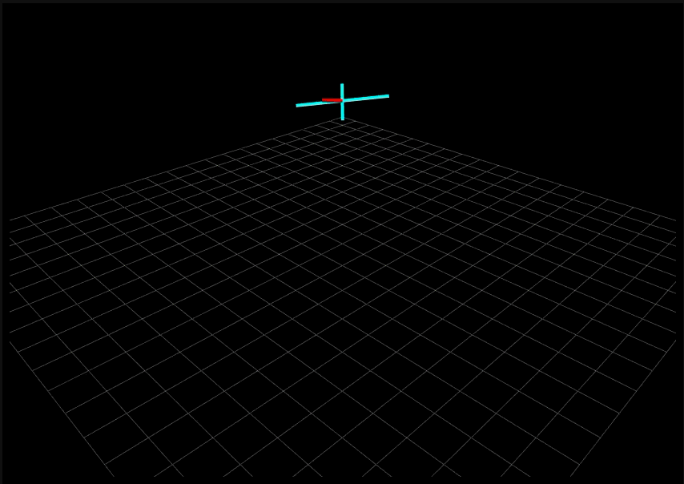
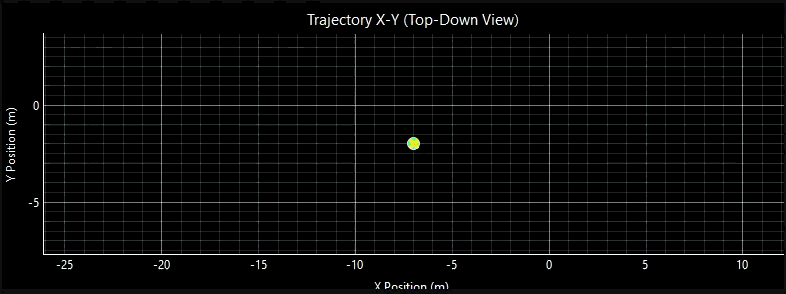
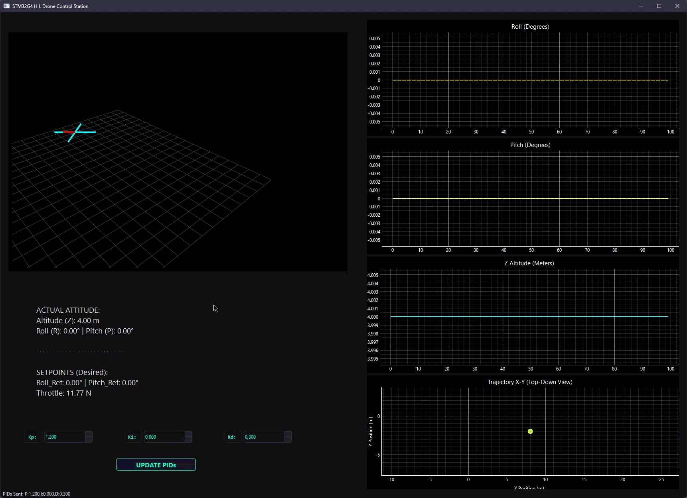

# STM32 HIL (Hardware-in-the-Loop) Quadcopter Simulator

A Hardware-in-the-Loop (HIL) simulation framework designed for a 6-Degrees-of-Freedom (6DoF) quadcopter. This project bridges a real-time embedded flight controller running on an **STM32 microcontroller** with a custom **PyQt6 Ground Control Station (GCS)** over a high-speed USB CDC virtual COM port.

---

## Graphical User Interface

The custom-built PyQt6 Ground Control Station (GCS) provides a fully integrated industrial dark aerospace environment for real-time telemetry monitoring and flight control:



---

### Telemetry & 3D Digital Twin

| 3D OpenGL Digital Twin Viewer | Tactical Top-Down Radar (X-Y Plane) |
| :---: | :---: |
|  |  |
| *Real-time 6DoF wireframe rendering with active 3D trajectory history.* | *Dynamic auto-centering X-Y radar with locked aspect ratio.* |

---

## 🚀 Live Flight Simulation Demo

Here is a demonstration of the manual flight mode in action. Notice the seamless real-time synchronization between keyboard inputs (`W, A, S, D`), the STM32 6DoF physics calculations, the 3D digital twin rotation, and the tactical radar tracking:



---

## Key Features

* **Dual-Loop Real-Time Architecture (STM32):**
  * **Inner Attitude Loop (1000 Hz):** Handles high-frequency PID stabilization for Roll, Pitch, and Yaw using hardware timer interrupts (`TIM6`).
  * **Outer Navigation Loop (100 Hz):** Computes spatial positioning and velocity vectors.
* **Rigid-Body 6DoF Physics Engine (`physics.c`):** 
  * Implements full rigid-body dynamics, considering mass moments of inertia, tilt-based horizontal coupling ($X, Y, Z$ accelerations derived from thrust and attitude vectors), and simulated aerodynamic drag/friction.
* **Asynchronous Communication Protocol:**
  * Uses a robust, non-blocking key-value string protocol (`KEY:val,KEY:val...\n`) over USB CDC for telemetry downlinking and PID/mode configuration uplinking.
* **Custom PyQt6 GCS (Ground Control Station):**
  * **Tactical Top-Down Trajectory Radar ($X-Y$ plane):** Features dynamic auto-centering and real-time path tracking.
  * **3D OpenGL Digital Twin Viewer:** Real-time 6DoF wireframe rendering that updates dynamically based on live orientation and spatial translation.
  * **Industrial Dark Aerospace UI:** Custom styling optimized for engineering monitoring.

---

## System Architecture

```text
+-----------------------+              USB CDC (Virtual COM)              +---------------------------+
|                       |  Telemetry (R, P, Z, X, Y, Ref)                 |                           |
|   STM32 Controller    | ----------------------------------------------> |      PyQt6 GCS (PC)       |
|  (Firmware / C)       |                                                 |  - Tactical X-Y Radar     |
|                       |  Commands (SET:x,y,z / Key Input)               |  - 3D OpenGL Twin Viewer  |
| - 1000Hz Attitude PID | <---------------------------------------------- |  - Real-time Plotting     |
| - 100Hz Navigation    |                                                 |                           |
+-----------------------+                                                 +---------------------------+
```

## Tech Stack & Tools

* **Hardware:** STM32G474 WeAct Studio Mini core Board.
* **Embedded Firmware:** C, STM32 HAL / Low-Level Drivers, CMSIS, Hardware Timers.
* **Ground Control Station:** Python 3.10+, PyQt6, PyQtGraph, PyOpenGL, NumPy, PySerial.
* **Communication:** USB Device Library (CDC class, Virtual COM port).

---

## Project Structure

```text
├── firmware_hil_drone/              # STM32 Embedded Firmware (STM32CubeIDE)
│   ├── Core/
│   │   ├── Inc/
│   │   │   ├── config.h             # System parameters & physical constants
│   │   │   ├── control.h            # Control loop headers
│   │   │   ├── physics.h            # 6DoF physics engine definitions
│   │   │   ├── pid.h                # PID controller structures
│   │   │   └── telemetry.h          # Serial protocol parser and builder
│   │   └── Src/
│   │       ├── config.c             # Configuration loading & defaults
│   │       ├── control.c            # Cascaded control loops & interrupt handlers
│   │       ├── physics.c            # Rigid-body 6DoF equations & aerodynamics
│   │       ├── pid.c                # PID mathematics implementation
│   │       └── telemetry.c          # Asynchronous CDC command parser
│   └── USB_Device/                  # USB CDC Virtual COM port implementation
│
└── desktop_application/             # PyQt6 Ground Control Station (GCS)
    ├── views/
    │   ├── main_window.py           # Main application layout & UI orchestration
    │   ├── plot_manager.py          # pyqtgraph telemetry & tactical X-Y radar
    │   └── viewer_3d.py             # PyOpenGL 6DoF digital twin renderer
    ├── gcs_layout.ui                # Qt Designer layout file
    ├── main.py                      # Application entry point
    └── telemetry_core.py            # Serial communication thread & parser
```

## Project Structure

1. Firmware Setup
  * Open the firmware_hil_drone project in STM32CubeIDE.
  * Build and flash the firmware onto your target STM32 board (optimized for STM32G4 series).
  * Ensure USB Device CDC is active in the project configurations.

2. Ground Control Station Setup
  * Navigate to the desktop application directory:
```
cd desktop_application
```
  * Install the required dependencies:
```
pip install pyqt6 pyqtgraph pyopengl numpy pyserial
```
  * Run the GCS application:
```
python main.py
```

## Manual Flight Mode Operation

* **W / S:** Adjust Forward / Backward spatial target ($X$-axis).
* **A / D:** Adjust Left / Right spatial target ($Y$-axis).
* **R / F:** Adjust Up / Down altitude target ($Z$-axis).

## License

Distributed under the MIT License. See LICENSE for more information.
